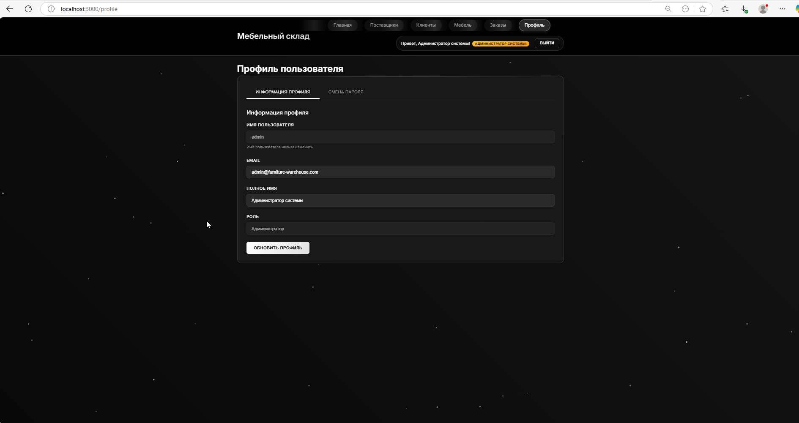
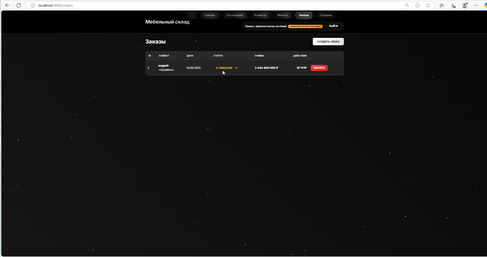
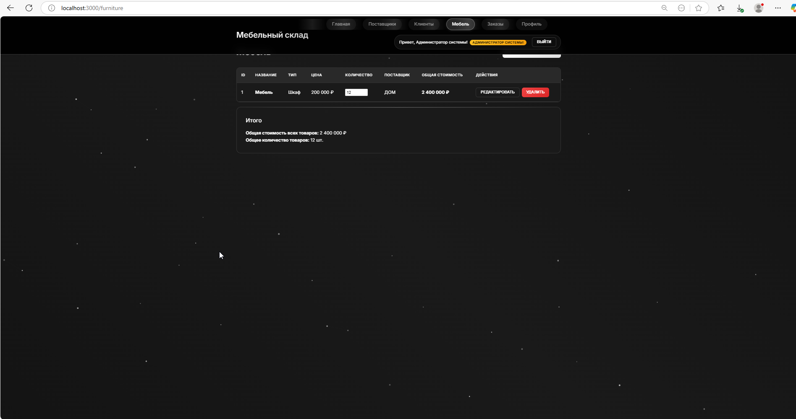
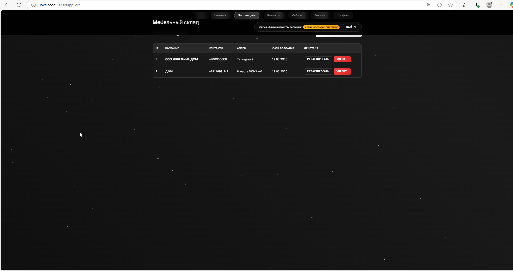
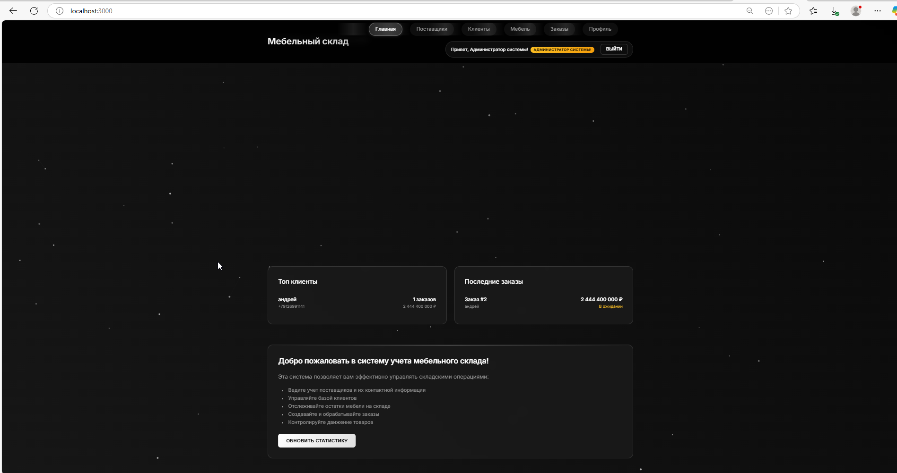
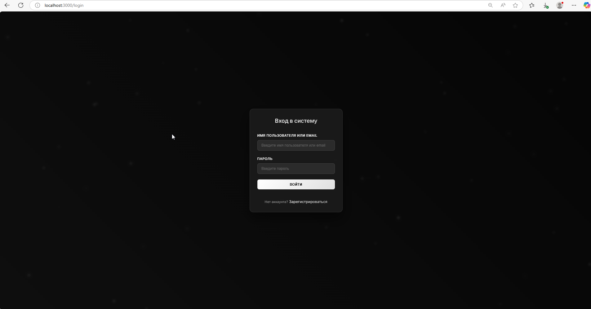

# Система учета мебельного склада

Полнофункциональное веб-приложение для управления мебельным складом с возможностями CRUD операций, системой авторизации и современным анимированным интерфейсом.

## Технологии

- **Backend**: Node.js, Express.js, SQLite, JWT, bcryptjs
- **Frontend**: React, Axios, Framer Motion, React Spring
- **База данных**: SQLite (автоматически создается)
- **Авторизация**: JWT токены с ролевой системой
- **Анимации**: Framer Motion, CSS анимации, Canvas API

## Функциональность

### 🔐 Система авторизации:
- **Регистрация и вход** - безопасная аутентификация пользователей
- **JWT токены** - защищенные сессии с автоматическим обновлением
- **Ролевая система** - пользователи и администраторы
- **Управление профилем** - изменение данных и пароля
- **Защищенные маршруты** - доступ только для авторизованных пользователей

### 📊 Расширенная аналитика Dashboard:
- **Основная статистика** - количество поставщиков, клиентов, товаров, заказов
- **Статистика заказов** - в ожидании, выполненные, отмененные, общая сумма
- **Складская аналитика** - товары с низким остатком, отсутствующие товары
- **Топ клиенты** - самые активные клиенты по количеству заказов
- **Последние заказы** - свежие заказы с деталями
- **Предупреждения** - автоматические уведомления о критических остатках

### 🎨 Современный дизайн и анимации:
- **Черно-белая тема** - элегантный минималистичный дизайн
- **Анимированный фон** - интерактивные частицы с Canvas API
- **Плавные переходы** - анимации страниц и компонентов
- **Интерактивные элементы** - hover-эффекты, анимированные кнопки
- **Адаптивный дизайн** - оптимизация для всех устройств

### 🏢 Основные возможности:
- 🏢 **Поставщики** - управление поставщиками и их контактами
- 👥 **Клиенты** - база клиентов с контактной информацией
- 🪑 **Мебель** - каталог товаров с ценами и остатками
- 📋 **Заказы** - создание и управление заказами
- 👤 **Профиль** - управление учетной записью

### Сущности базы данных:
- **Пользователи** (ID, Имя пользователя, Email, Пароль, Роль, ФИО)
- **Поставщики** (ID, Название, Контакты, Адрес)
- **Клиенты** (ID, Имя, Телефон, Адрес)
- **Мебель** (ID, Название, Тип, Цена, Количество, ПоставщикID)
- **Заказы** (ID, КлиентID, Дата, Статус, Общая сумма)
- **Товары в заказе** (ЗаказID, МебельID, Количество, Цена)

## Установка и запуск

### Предварительные требования
- Node.js (версия 14 или выше)
- npm или yarn

### 1. Установка зависимостей

```bash
# Установка зависимостей для всего проекта
npm run install-all

# Или установка по отдельности:
npm install
cd backend && npm install
cd ../frontend && npm install
```

### 2. Создание администратора

```bash
cd backend
npm run create-admin
```

**Данные администратора по умолчанию:**
- Имя пользователя: `admin`
- Email: `admin@furniture-warehouse.com`
- Пароль: `admin123`

⚠️ **ВАЖНО:** Смените пароль после первого входа!

### 3. Запуск приложения

#### Для Windows PowerShell:
```powershell
# Backend (в одном терминале)
cd backend
npm start

# Frontend (в другом терминале)
cd frontend
npm start
```

#### Для Linux/Mac:
```bash
# Запуск всего приложения одной командой
npm run dev

# Или запуск по отдельности:
cd backend && npm run dev &
cd frontend && npm start
```

### 4. Доступ к приложению

- **Frontend**: http://localhost:3000
- **Backend API**: http://localhost:5000
- **API документация**: http://localhost:5000 (базовая информация)

## API Endpoints

### 🔐 Авторизация
- `POST /api/auth/register` - регистрация нового пользователя
- `POST /api/auth/login` - вход пользователя
- `GET /api/auth/profile` - получить профиль (защищено)
- `PUT /api/auth/profile` - обновить профиль (защищено)
- `POST /api/auth/change-password` - изменить пароль (защищено)
- `GET /api/auth/users` - получить всех пользователей (только admin)
- `DELETE /api/auth/users/:id` - удалить пользователя (только admin)

### 🏢 Поставщики (защищено)
- `GET /api/suppliers` - получить всех поставщиков
- `GET /api/suppliers/:id` - получить поставщика по ID
- `POST /api/suppliers` - создать поставщика
- `PUT /api/suppliers/:id` - обновить поставщика
- `DELETE /api/suppliers/:id` - удалить поставщика

### 👥 Клиенты (защищено)
- `GET /api/clients` - получить всех клиентов
- `GET /api/clients/:id` - получить клиента по ID
- `POST /api/clients` - создать клиента
- `PUT /api/clients/:id` - обновить клиента
- `DELETE /api/clients/:id` - удалить клиента

### 🪑 Мебель (защищено)
- `GET /api/furniture` - получить всю мебель
- `GET /api/furniture/:id` - получить мебель по ID
- `POST /api/furniture` - создать мебель
- `PUT /api/furniture/:id` - обновить мебель
- `PATCH /api/furniture/:id/quantity` - обновить количество
- `DELETE /api/furniture/:id` - удалить мебель

### 📋 Заказы (защищено)
- `GET /api/orders` - получить все заказы
- `GET /api/orders/:id` - получить заказ по ID с деталями
- `POST /api/orders` - создать заказ
- `PATCH /api/orders/:id/status` - обновить статус заказа
- `DELETE /api/orders/:id` - удалить заказ

## Структура проекта

```
furniture-warehouse-management/
├── backend/                 # Backend приложение
│   ├── auth/               # JWT авторизация
│   │   └── jwt_token.js    # JWT утилиты и middleware
│   ├── controllers/        # Контроллеры для бизнес-логики
│   │   ├── authController.js    # Контроллер авторизации
│   │   ├── supplierController.js
│   │   ├── clientController.js
│   │   ├── furnitureController.js
│   │   └── orderController.js
│   ├── routes/            # API маршруты
│   │   ├── auth.js        # Маршруты авторизации
│   │   ├── suppliers.js
│   │   ├── clients.js
│   │   ├── furniture.js
│   │   └── orders.js
│   ├── scripts/           # Утилиты
│   │   └── createAdmin.js # Создание администратора
│   ├── database.js        # Настройка базы данных
│   ├── server.js          # Основной сервер
│   └── package.json       # Зависимости backend
├── frontend/              # React приложение
│   ├── public/           # Статические файлы
│   ├── src/              # Исходный код React
│   │   ├── components/   # React компоненты
│   │   │   ├── AnimatedBackground.js  # Анимированный фон
│   │   │   ├── AnimatedButton.js      # Анимированные кнопки
│   │   │   ├── Dashboard.js           # Расширенная аналитика
│   │   │   ├── Login.js               # Форма входа
│   │   │   ├── Register.js            # Форма регистрации
│   │   │   ├── Profile.js             # Управление профилем
│   │   │   └── ...                    # Остальные компоненты
│   │   ├── contexts/     # React контексты
│   │   │   └── AuthContext.js         # Контекст авторизации
│   │   ├── services/     # API сервисы
│   │   │   └── api.js    # API клиент с авторизацией
│   │   ├── App.js        # Основной компонент с защищенными маршрутами
│   │   ├── index.css     # Стили с анимациями
│   │   └── index.js      # Точка входа
│   └── package.json      # Зависимости frontend
├── AUTH_README.md        # Подробная документация по авторизации
├── package.json          # Основной package.json
└── README.md            # Документация
```

## Особенности

### 🔐 Безопасность:
- JWT токены с автоматическим обновлением (24 часа)
- Хеширование паролей с bcrypt (salt rounds = 10)
- Защищенные маршруты с middleware
- Ролевая система доступа
- Валидация данных на всех уровнях

### 🎨 Дизайн и UX:
- Современная черно-белая тема с градиентами
- Анимированный фон с интерактивными частицами
- Плавные переходы между страницами (Framer Motion)
- Анимированные формы и кнопки
- Адаптивный дизайн для всех устройств
- Стеклянные эффекты (backdrop-filter)

### 📊 Аналитика:
- Детальная статистика по всем сущностям
- Предупреждения о критических остатках
- Топ клиенты по активности
- История последних заказов
- Цветовая индикация статусов

### Backend:
- Автоматическая инициализация базы данных SQLite
- Валидация данных на уровне API
- Транзакции для сложных операций (создание заказов)
- CORS настроен для работы с frontend
- Обработка ошибок и логирование
- JWT middleware для защиты маршрутов

### Frontend:
- Современный адаптивный дизайн с анимациями
- Интуитивная навигация с защищенными маршрутами
- Валидация форм с анимированными ошибками
- Обработка ошибок с пользовательскими сообщениями
- Автоматическое обновление данных
- Быстрое редактирование количества товаров
- Детальный просмотр заказов
- Управление профилем пользователя

## База данных

База данных SQLite создается автоматически при первом запуске backend.
Файл базы данных: `backend/warehouse.db`

### Схема базы данных:
- **users** - пользователи системы с ролями
- **suppliers** - поставщики
- **clients** - клиенты
- **furniture** - товары
- **orders** - заказы
- **order_furniture** - связь заказов и товаров

### Связи:
- Связь "один ко многим" между поставщиками и мебелью
- Связь "один ко многим" между клиентами и заказами  
- Связь "многие ко многим" между заказами и мебелью через промежуточную таблицу

## Авторизация

### Роли пользователей:
- **user** - обычный пользователь (доступ ко всем основным функциям)
- **admin** - администратор (дополнительно: управление пользователями)

### Первый запуск:
1. Создайте администратора: `cd backend && npm run create-admin`
2. Войдите в систему с данными admin/admin123
3. Смените пароль в профиле
4. Создавайте новых пользователей через форму регистрацию

Подробная документация по авторизации: [AUTH_README.md](AUTH_README.md)

## Разработка

### Добавление новых функций:
1. Backend: создайте контроллер в `backend/controllers/`
2. Backend: добавьте маршруты в `backend/routes/`
3. Backend: подключите маршруты в `backend/server.js`
4. Frontend: добавьте API методы в `frontend/src/services/api.js`
5. Frontend: создайте компонент в `frontend/src/components/`

### Стили и анимации:
- Основные стили: `frontend/src/index.css`
- CSS переменные для цветовой схемы
- Framer Motion для компонентных анимаций
- Canvas API для анимированного фона

### Переменные окружения:
Создайте файл `.env` в папке backend:
```env
JWT_SECRET=your_super_secret_jwt_key_here
JWT_EXPIRES_IN=24h
```

## Поддержка

### Устранение неполадок:
1. Убедитесь, что установлены все зависимости
2. Проверьте, что порты 3000 и 5000 свободны
3. Проверьте логи в консоли backend и frontend
4. Убедитесь, что база данных создалась корректно
5. Для Windows PowerShell используйте `;` вместо `&&` в командах

### Известные проблемы:
- В PowerShell не работает `&&`, используйте отдельные команды
- При первом запуске может потребоваться время для создания базы данных
- Убедитесь, что создан администратор перед первым входом

## Скриншоты

### 🏠 Главная страница (Dashboard)
Расширенная аналитика с детальной статистикой, топ клиентами и предупреждениями о складе.



### 🔐 Система авторизации

#### Форма входа
Современная форма входа с анимированным фоном и стеклянными эффектами.



#### Форма регистрации
Регистрация новых пользователей с валидацией полей.



### 👤 Управление профилем
Вкладки для управления профилем и смены пароля.



### 🏢 Управление поставщиками
CRUD операции для поставщиков с современным интерфейсом.



### 👥 Управление клиентами
База клиентов с возможностью добавления, редактирования и удаления.


### 🪑 Каталог мебели
Управление товарами с быстрым редактированием количества и связью с поставщиками.



### ✨ Особенности интерфейса
- **Анимированный фон** с интерактивными частицами
- **Черно-белая тема** с градиентами и стеклянными эффектами
- **Плавные переходы** между страницами с Framer Motion
- **Адаптивный дизайн** для всех устройств
- **Hover-эффекты** и анимированные кнопки
- **Современная типографика** с шрифтом Inter

## Лицензия

MIT License 